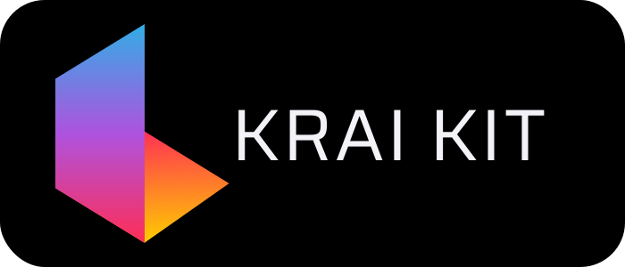

<p align="center">
  <a href="https://krai-kit.dev" target="_blank" rel="noopener noreferrer">
    
  </a>
</p>
<p align="center">
  <a href="https://github.com/krai-tech/krai-kit"></a>
  <a href="https://angular.io/"></a>
  </br>
  <a href="https://krai-kit.dev/en/docs"></a>
  <a href="https://krai-kit.dev/ua/docs"></a>
  <a href="https://www.npmjs.com/package/krai-tech"></a>
</p>

<h1 align="center">KRAIKIT - Angular UI Component Library</h1>

The primary set of components used to build your applications

## Angular Support

Supports Angular <font color=red>`^17.0.0`</font>

## Features

- **Customizable Components**: Easily modify components to match your brand’s look and feel.
- **Responsive Design**: Components are optimized for all screen sizes, ensuring a seamless experience across devices.
- **Accessibility**: Built with accessibility in mind to ensure that everyone can use your application.
- **Documentation**: Comprehensive documentation to help you get started quickly.
- **Community Support**: Join our community to share tips, get support, and collaborate on new features.

## Installation

```bash
npm i @krai-tech/kit
# or
yarn i @krai-tech/kit
```

## Getting Started

```typescript
import { ButtonComponent } from '@krai-tech/kit/button';
import { CommonModule } from '@angular/common';
import { Component } from '@angular/core';

@Component({
  selector: 'app-component',
  standalone: true,
  imports: [CommonModule, ButtonComponent],
  template: `<button kriButton>Text Button</button>`,
})
export class AppComponent {}
```

## Documentation

Check out our [Documentation](https://krai-kit.dev/en/docs/getting-started) for detailed instructions, examples, and guidelines on how to integrate and use [**@krai-kit**](https://github.com/krai-tech/krai-kit) components in your Angular apps.


## Community and Support

Join our [Discord](https://discord.com) for support, discussion, and more. Follow us on [Twitter](https://twitter.com) for the latest updates.

## Contribution

Yes please! See the
[contributing guidelines](https://krai-kit.dev/en/docs/contribution)
for details. a comprehensive guide and API reference, visit our [Documentation](https://krai-kit.dev/en/docs/getting-started) page.

## License

This project is licensed under the terms of the
[MIT license](https://github.com/krai-tech/krai-kit/blob/master/LICENSE).


From 🇺🇦 With ❤️
