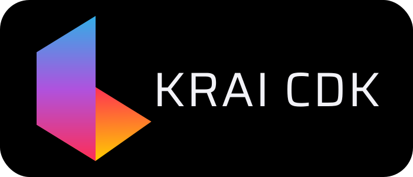

<p align="center">
  <a href="https://krai-kit.dev">
      
  </a>
</p>

<h1 align="center">@krai-cdk</h1>

<div align="center">
  <a href="https://npmjs.com/package/@krai-tech/cdk">
    
  </a>
  <a href="https://opensource.org/licenses/MIT">
    
  </a>
</div>

[Website](https://krai-kit.dev)

> A developer toolkit consisting of low-level tools and abstractions used for developing Angular components.

This is part of [**@krai-kit**](https://github.com/krai-tech/krai-kit), a fully tree-shakable, which includes several core libraries, pipes, directives, base-classes, units and etc.

## Installation

```bash
npm i @krai-tech/cdk
# or
yarn i @krai-tech/cdk
```

## Contribution

Yes please! See the
[contributing guidelines](https://krai-kit.dev/en/docs/contribution)
for details.

## Documentation

[Getting Started](https://krai-kit.dev/en/docs/getting-started)

## License

This project is licensed under the terms of the
[MIT license](https://github.com/krai-tech/krai-kit/blob/master/LICENSE).
